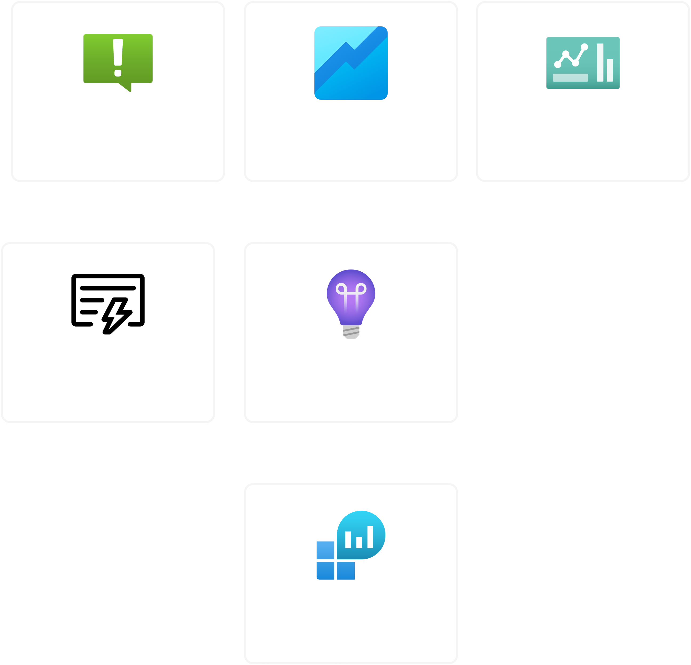
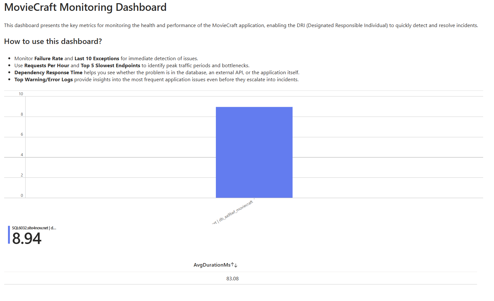
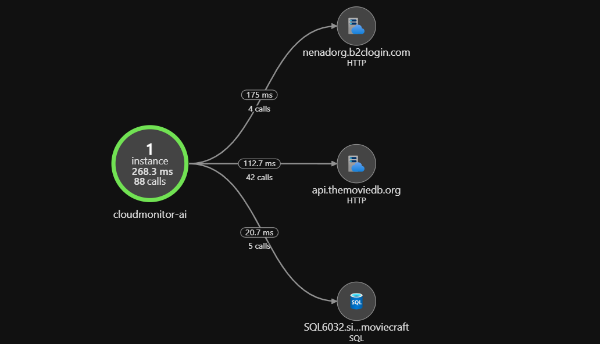

# 🌩️ CloudMonitorSuite - Azure Monitoring Solution for MovieCraft


[](https://dev.azure.com/Nenad984/CloudMonitorSuite/_build/latest?definitionId=19&branchName=main)

**CloudMonitorSuite** is a **cloud monitoring and observability platform** built for tracking, analyzing, and troubleshooting the behavior of cloud-based applications like **MovieCraft**. This solution leverages **Azure Application Insights**, **Log Analytics**, **Azure Workbooks**, and **Kusto Query Language (KQL)** to provide real-time telemetry, performance monitoring, and diagnostics capabilities.

## 🔍 Live Monitoring Dashboard & Application

[](https://portal.azure.com/#@/dashboard/arm)
[](https://nenadtara-001-site3.jtempurl.com/)

> **⚠️ Note:** Azure portal access with appropriate permissions required to view the live monitoring dashboard. The MovieCraft application is the target system being monitored by CloudMonitorSuite.

---

## 📖 Table of Contents

- [🌩️ CloudMonitorSuite - Azure Monitoring Solution for MovieCraft](#️-cloudmonitorsuite---azure-monitoring-solution-for-moviecraft)
  - [🔍 Live Monitoring Dashboard \& Application](#-live-monitoring-dashboard--application)
  - [📖 Table of Contents](#-table-of-contents)
  - [📚 Project Overview](#-project-overview)
  - [✨ Key Capabilities](#-key-capabilities)
  - [🛠️ Tech Stack \& Tools](#️-tech-stack--tools)
    - [Monitoring Infrastructure](#monitoring-infrastructure)
    - [Infrastructure \& Deployment](#infrastructure--deployment)
    - [Integration Targets](#integration-targets)
  - [📊 Monitoring Architecture](#-monitoring-architecture)
  - [📈 Workbook Dashboard](#-workbook-dashboard)
  - [📊 Application Map](#-application-map)
  - [📂 KQL Queries \& Analysis](#-kql-queries--analysis)
  - [🚀 Deployment \& Cost Optimization](#-deployment--cost-optimization)
    - [Infrastructure as Code](#infrastructure-as-code)
    - [Automated Deployment](#automated-deployment)
    - [Cost Management](#cost-management)
  - [📄 License](#-license)

---

## 📚 Project Overview

**CloudMonitorSuite** is a fully automated Azure monitoring solution that tracks key metrics and behaviors for cloud applications. It was primarily designed to monitor the **MovieCraft application** - a Blazor Hosted web application hosted externally on **SmarterASP.NET**. The suite ingests telemetry via **Application Insights SDK**, allowing centralized observability over API performance, SQL dependencies, failed requests, and application exceptions.

This project demonstrates **cloud-first observability strategies** and provides a foundation for implementing **Site Reliability Engineering (SRE)** practices in modern application environments. With CloudMonitorSuite, teams can establish comprehensive monitoring of distributed systems without modifying application code beyond initial instrumentation.

---

## ✨ Key Capabilities

- 🔍 **Application Performance Monitoring**
  - Real-time metrics on request volumes, response times, and error rates
  - Automatic dependency tracking for SQL, HTTP, and external service calls
- 📊 **Analytics & Visualization**
  - Custom workbooks for powerful data visualization and sharing
  - Application map for service dependency visualization
- 🚨 **Proactive Alerting**
  - Smart Detection of anomalies in request patterns
  - Configurable alert thresholds for critical metrics
- 📝 **Log Analytics & Query**
  - Centralized log storage with powerful KQL query capabilities
  - Pre-built query library for common monitoring scenarios
- 🛡️ **Cost Management**
  - Free tier optimization to minimize cloud expenses
  - Budget alerts to prevent unexpected costs

---

## 🛠️ Tech Stack & Tools

### Monitoring Infrastructure

- **Azure Application Insights**: Telemetry collection and real-time metrics
- **Azure Log Analytics**: Centralized log storage and advanced querying
- **Azure Workbooks**: Interactive dashboards and visualization
- **Kusto Query Language (KQL)**: SQL-like query language for logs and metrics

### Infrastructure & Deployment

- **Azure Bicep**: Infrastructure-as-Code for automated deployments
- **Azure Resource Manager (ARM)**: Resource provisioning and management
- **Azure Pipelines**: CI/CD pipeline for infrastructure deployment
- **PowerShell**: Automation scripts for identity and access management, including federated credentials (`create-identity.ps1`) for secure CI/CD integration

### Integration Targets

- **MovieCraft App**: Blazor WebAssembly application with .NET backend
- **Application Insights SDK**: Client libraries for telemetry collection

---

## 📊 Monitoring Architecture

CloudMonitorSuite implements a modern cloud monitoring architecture consisting of:

- ✅ **Application Insights instance** (`cloudMonitor-ai`): Collects and analyzes telemetry from applications
- ✅ **Log Analytics Workspace** (`cloudMonitor-log`): Centralized storage for logs and metrics
- ✅ **Smart Detection and Anomaly Rules**: Automated detection of unusual patterns
- ✅ **Custom Workbooks Dashboard**: Interactive visualization dashboards
- ✅ **Application Map**: Visual representation of application components and their relationships
- ✅ **Linked external MovieCraft application**: Source of telemetry data



The architecture follows these principles:

1. **Separation of concerns**: Monitoring infrastructure is separate from application code
2. **Infrastructure as Code**: All resources are defined in Bicep templates
3. **Centralized observability**: Single pane of glass for application performance
4. **Cost optimization**: Resources configured to use free tiers where possible

---

## 📈 Workbook Dashboard

CloudMonitorSuite provides a comprehensive Azure Workbook dashboard that visualizes key metrics:



The dashboard includes:

- **Summary Tiles**: At-a-glance metrics for total requests, failures, and response times
- **Performance Charts**: Detailed visualizations of requests per hour and slowest endpoints
- **Dependency Charts**: Performance analysis of database calls and external API dependencies
- **Errors & Exceptions**: Real-time tracking of application exceptions and warning patterns

The workbook is designed to be interactive, allowing users to filter by time range, drill down into specific metrics, and investigate issues through linked Log Analytics queries.

---

## 📊 Application Map

CloudMonitorSuite automatically generates an Application Map for visualizing the relationships between application components:



The Application Map provides:

- **Component Visualization**: Visual representation of the MovieCraft application and its dependencies
- **Health Indicators**: Color-coded status indicators for each component
- **Performance Metrics**: Request counts and response times for each component
- **Dependency Analysis**: Clear visualization of external dependencies and their health

This visual tool helps quickly identify bottlenecks, failed dependencies, and the overall structure of the application ecosystem.

---

## 📂 KQL Queries & Analysis

CloudMonitorSuite includes a comprehensive library of Kusto Query Language (KQL) queries for common monitoring scenarios:

```kusto
// Sample: Failed Requests Analysis
requests
| where timestamp > ago(24h)
| where success == false
| summarize FailureCount=count() by operation_Name, resultCode
| order by FailureCount desc
```

All queries are stored in the [KQL Queries folder](./kql-queries) for easy access:

- `total-requests.kql`: Track overall application traffic
- `failure-rate.kql`: Monitor application health and error rates
- `average-response-time.kql`: Analyze application performance
- `requests-per-hour.kql`: Visualize usage patterns over time
- `slowest-endpoints.kql`: Identify performance bottlenecks
- `dependency-performance.kql`: Monitor external service calls
- `exceptions.kql`: Track application errors and exceptions
- `warning-error-logs.kql`: Analyze application log patterns

These queries power the visualizations in the workbooks and can be used for ad-hoc analysis in the Azure portal.

---

## 🚀 Deployment & Cost Optimization

CloudMonitorSuite is designed for simple, reliable deployment with cost optimization built in:

### Infrastructure as Code

All resources are defined using **Azure Bicep** templates, providing:

- Consistent, repeatable deployments
- Version-controlled infrastructure
- Easy customization through parameters
- Modular design for component reuse

### Automated Deployment

The solution is deployed through an **Azure Pipeline** defined in [`azure-pipelines.yml`](./azure-pipelines.yml):

```yaml
# Pipeline stages:
# 1. Bicep Linting - Code quality checks
# 2. What-If Analysis - Preview changes
# 3. Deploy to Azure - Create/update resources
```

The pipeline uses OIDC (OpenID Connect) with federated credentials established by the [`create-identity.ps1`](./scripts/create-identity.ps1) script for secure, passwordless authentication to Azure resources. This modern approach eliminates the need for storing service principal secrets and provides enhanced security through short-lived tokens.

### Cost Management

CloudMonitorSuite is carefully optimized to minimize Azure costs:

- **Free Tier Usage**: Resources configured within Azure's free tier limits
- **Data Volume Caps**: Log Analytics workspace configured with daily caps
- **Retention Policies**: 30-day retention policy to balance storage costs
- **Budget Alerts**: Cost budget with email notifications at threshold levels

> **💰 Cost Note:** The demo deployment generates no additional Azure cost when kept within free tier limits.

---

## 📄 License

This project is licensed under the **MIT License** - see the [LICENSE.txt](LICENSE.txt) file for details.

---

**CloudMonitorSuite demonstrates practical cloud monitoring, observability, and diagnostic capabilities using Azure-native tools and infrastructure as code practices.**
